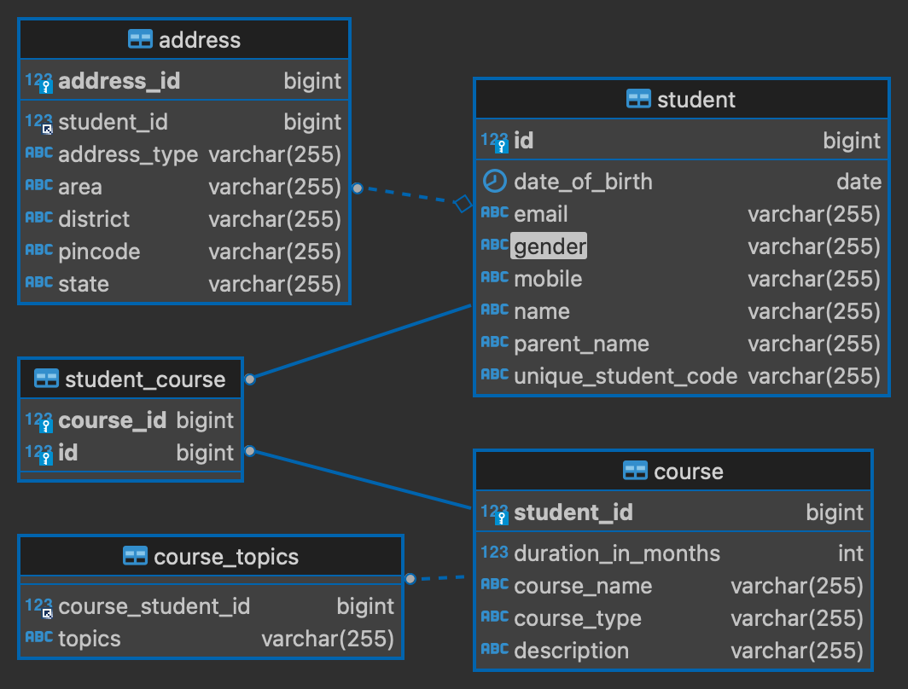

# Student Management System



## Table of Contents

- [Introduction](#introduction)
- [Tech Stack](#tech-stack)
- [How to Use](#how-to-use)
- [API Documentation](#api-documentation)
- [Contributing](#contributing)

## Introduction

The Student Management System is a Spring Boot-based application designed to manage student information, courses, and assignments efficiently.

## Tech Stack

- Spring Boot
- MySQL Database
- ModelMapper (for mapping between entities and DTOs)

## How to Use

Follow these steps to set up and run the Student Management System:

1. **Database Configuration:**
   - Create a MySQL database.
   - Update the database configuration in `application.properties`:

   ```properties
   spring.datasource.url=jdbc:mysql://localhost:3306/your_database
   spring.datasource.username=your_username
   spring.datasource.password=your_password

2. **Build and Run:**

    Clone the repository and navigate to the project directory.
    Build the project using Maven or Gradle:

    mvn clean install


   gradlew clean build
     **Run the Spring Boot application:**

**command:**

 java -jar target/student-management-system.jar

    Access the Application:
        The application will be available at http://localhost:8080.
        Use Postman or your web browser to interact with the API.

API Documentation

    API documentation is available using Swagger. Access the Swagger UI at http://localhost:8080/swagger-ui.html.

Contributing

Contributions are welcome! If you want to contribute to this project, please follow these steps:

    Fork the repository.
    Create a new branch: git checkout -b feature/your-feature-name.
    Commit your changes: git commit -m 'Add some feature'.
    Push to the branch: git push origin feature/your-feature-name.
    Submit a pull request.